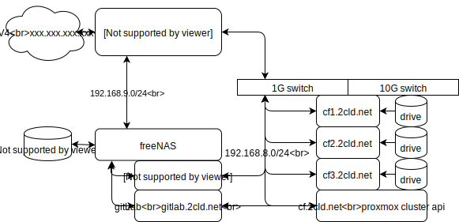

# Infrastructure

Goal: Looseleaf edge cloud infrasture setup, test, monitoring and useablity study.

## Task

| Task           | Goal | Status  |
| Setup FreeNAS  | User storage access [lls-FreeNAS Setup]() document | |
| Setup gitLab   | User access [lls-gitLab Setup]() document  | |
| Setup firewall | Remote access by User [lls-firewall Setup]() document. | |

## Infrastructure Diagram

Source edit [lls-infrastructure-diagram draw.io](https://www.draw.io/#Hlooseleaf%2Flls-nodejs-test%2Fmaster%2Fdocs%2Fimages%2Flls-infrastructure-diagram.drawio)

### Server H/W

| Device | Description | Link |
| ----------- | ---------------- | --------- |
| FreeNAS HB  | CPU HB           | [cpu Xeon E3-1230](https://ark.intel.com/content/www/us/en/ark/products/97474/intel-xeon-processor-e3-1230-v6-8m-cache-3-50-ghz.html) |
| FreeNAS HB  | CPU CF           | [cpu Xeon E5462](https://ark.intel.com/content/www/us/en/ark/products/33084/intel-xeon-processor-e5462-12m-cache-2-80-ghz-1600-mhz-fsb.html) |

### Notes

1. [NGINX Reverse Proxy](https://www.nginx.com/resources/glossary/reverse-proxy-server/)
2. [gitlab CI/CD Tutorial](https://medium.com/devopslinks/beginner-friendly-introduction-to-gitlab-ci-cd-1c80ee5ba0ae)
3. [gitlab nodejs app deploy](https://medium.com/@seulkiro/deploy-node-js-app-with-gitlab-ci-cd-214d12bfeeb5)
4. [gitlab examples](https://gitlab.com/gitlab-examples)
5. [gitlab CI/CD](https://about.gitlab.com/2016/03/01/gitlab-runner-with-docker/)
6. [gitlab nginx https docker how-to](https://www.digitalocean.com/community/tutorials/how-to-secure-a-containerized-node-js-application-with-nginx-let-s-encrypt-and-docker-compose)
7. [gitlab autodevops](https://docs.gitlab.com/ee/topics/autodevops/#auto-monitoring)

[markdown cheat sheet](http://blog.christrees.com/wip/markdowntest.html)
